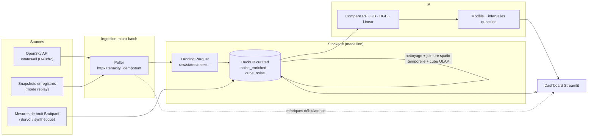
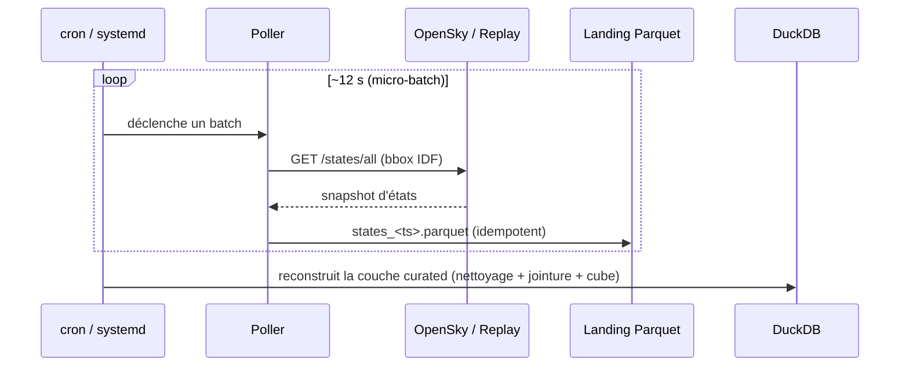

# ✈️ Ciel Tranquille — bruit aérien urbain

Vitrine analytique qui **mesure, analyse et prédit** le bruit aérien autour des
aéroports franciliens (CDG, Orly, Le Bourget) à partir de données de flux
aériens. Pipeline data de bout en bout : **ingestion micro-batch → stockage
DuckDB → transformation multi-sources → modèle ML → dashboard**.

Projet data personnel, conçu et développé en solo.

## Architecture



### Flux micro-batch



## Honnêteté technique

L'API gratuite OpenSky n'est **pas un flux *push*** : on fait du **polling
micro-batch** (≈1 req/10 s, latence 5–10 s). Le temps réel *push* (broker type
Kafka/Kinesis) est une **limite assumée** et un axe d'amélioration : l'architecture
est déjà découplée pour l'accueillir (insertion d'un broker entre poller et
stockage).

> Le modèle est entraîné sur des **données synthétiques reproductibles** (le tier
> gratuit OpenSky ne fournit qu'un snapshot instantané, insuffisant pour un
> historique d'entraînement). Le R² élevé valide **la méthode et le pipeline**,
> pas la précision en conditions réelles (`make eval-real` reporte la métrique
> réelle séparément).

## Démarrage rapide

```bash
make install        # venv + dépendances
make demo           # synth -> curated -> modèle (jeu de démonstration)
make dashboard      # http://localhost:8501
```

Ou via Docker : `make docker` (services `pipeline` + `dashboard`).

### Ingestion en conditions réelles (OpenSky live)

```bash
cp .env.example .env      # renseigner OPENSKY_CLIENT_ID / OPENSKY_CLIENT_SECRET
# puis CT_INGEST_MODE=live
make poll                 # ou scripts/run_cycle.sh (ordonnançable via cron/systemd)
```

## Commandes

| Commande | Rôle |
|---|---|
| `make demo` | Génère les données synthétiques, construit la couche curated, entraîne le modèle |
| `make poll` | Un cycle de micro-batches (ingestion → Parquet) |
| `make build` | Reconstruit la couche curated DuckDB |
| `make train` | Entraîne et **compare** 4 familles de modèles |
| `make eval-real` | Évalue le modèle sur l'échantillon **réel** (métrique séparée) |
| `make test` | Tests unitaires (pytest) |
| `make lint` | Lint (ruff) |
| `make dashboard` | Dashboard Streamlit |

## Structure

```
src/ciel_tranquille/   # package : ingest / storage / transform / ml / monitoring
dashboard/             # application Streamlit (accueil + 4 pages)
data/samples/          # échantillons versionnés (mesures de bruit, snapshot OpenSky)
data/raw, data/curated # landing Parquet + DuckDB (gitignorés, régénérables)
deploy/                # cron + systemd timer (ordonnancement)
tests/                 # tests unitaires + bout-en-bout
```

## Modèle ML

Comparaison de 4 familles (régression linéaire, Random Forest, Gradient Boosting,
HistGradientBoosting) en validation croisée 5-fold ; sélection par RMSE.
Incertitude par **régression quantile** (10 %/90 %). Anti-surapprentissage
(CV, suivi de l'écart train/test, régularisation) et anti-fuite de cible
(exclusion du `Lmax`, features avions recalculées par la jointure).

## Sécurité & confidentialité

Secrets OpenSky hors du code (`.env` gitignoré). Données de vol = techniques et
publiques ; **agrégation spatiale** (stations de mesure, jamais un domicile) et
minimisation des champs conservés.

## Crédits & sources de données

- **Bruitparif** — niveaux sonores mesurés via la plateforme
  [Survol](https://survol.bruitparif.fr/), publiés sous
  [Licence Ouverte / Open Licence Etalab v2.0](https://www.etalab.gouv.fr/licence-ouverte-open-licence/).
  Les échantillons de bruit versionnés (`data/samples/bruit_survol.csv`) en sont dérivés
  (attribution requise).
- **The OpenSky Network** — positions d'aéronefs via l'API `/states/all`
  ([opensky-network.org](https://opensky-network.org)), utilisée en mode *live* pour un
  usage recherche / éducatif non commercial, conformément à ses conditions.
  **Aucune donnée OpenSky brute n'est redistribuée ici** : le snapshot d'exemple
  (`data/samples/opensky_snapshot.csv`) est **synthétique**, produit par
  `scripts/gen_sample_snapshot.py`.
  > Schäfer, Strohmeier, Lenders, Martinovic, Wilhelm — *Bringing Up OpenSky: A
  > Large-scale ADS-B Sensor Network for Research*, ACM/IEEE IPSN 2014.

## Licence

Code sous licence **MIT** — voir [LICENSE](LICENSE). © 2026 Amir ANCIAUX.
